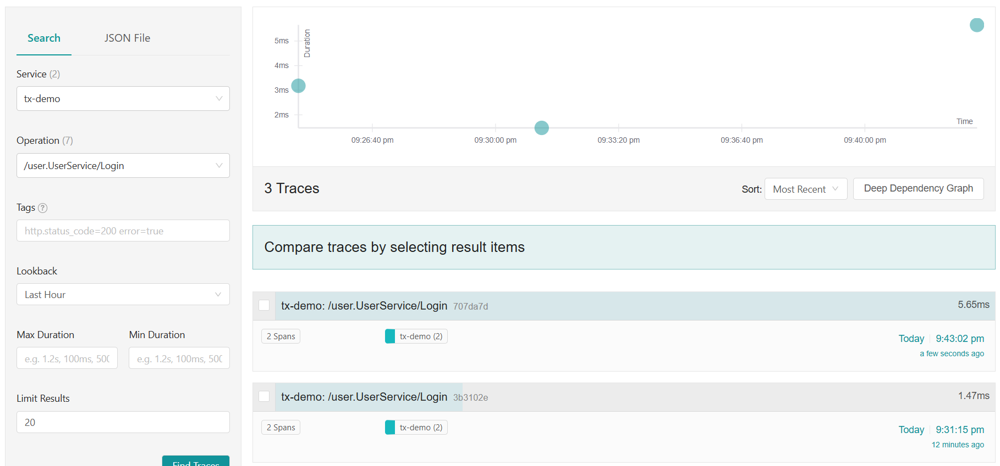
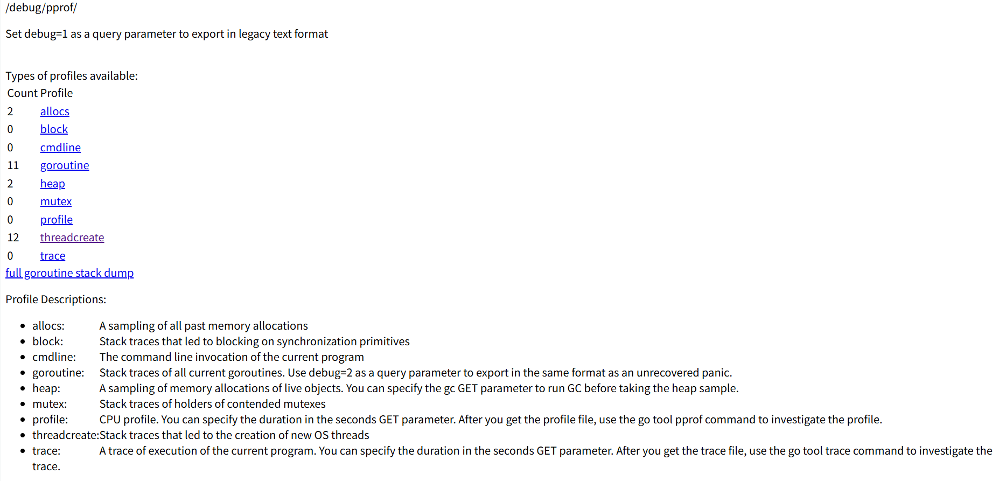

# 一.项目结构

```
- tx-demo
  - client
  - docker
  - model
  - pkg
  - repository
  - resources
  - system
  - user
```

# 二.安装中间件

### 通过 docker compose 安装

**docker-compose.yml**

```yml
version: '3.8'

services:
  # Redis服务
  redis:
    image: redis:7.0
    container_name: redis
    ports:
      - "6379:6379"
    volumes:
      - redis-data:/data
    restart: always
    command: redis-server --save 20 1 --loglevel warning

  # PostgreSQL服务（带向量插件）
  postgres:
    image: ankane/pgvector:v0.4.1
    container_name: postgres
    ports:
      - "5432:5432"
    environment:
      POSTGRES_USER: postgres
      POSTGRES_PASSWORD: postgres
      POSTGRES_DB: user_service
    volumes:
      - postgres-data:/var/lib/postgresql/data
      - ./init-scripts:/docker-entrypoint-initdb.d
    restart: always

  # Jaeger服务
  jaeger:
    image: jaegertracing/all-in-one:1.41
    container_name: jaeger
    ports:
      - "6831:6831/udp"  # Jaeger客户端发送数据的端口
      - "16686:16686"    # Jaeger UI端口
    environment:
      COLLECTOR_ZIPKIN_HOST_PORT: ":9411"
    restart: always

volumes:
  redis-data:
  postgres-data:  
```

# 三.业务逻辑

## 1.用户模块

**user.proto**

```protobuf
syntax = "proto3";

package user;

import "google/protobuf/empty.proto";
import "google/protobuf/timestamp.proto";

option go_package = "github.com/yourusername/yourproject/proto/user";

// 用户服务
service UserService {
  // 用户注册
  rpc Register (RegisterRequest) returns (RegisterResponse);
  
  // 用户登录
  rpc Login (LoginRequest) returns (LoginResponse);
  
  // 获取用户信息
  rpc GetUserInfo (google.protobuf.Empty) returns (UserInfoResponse);
}

// 注册请求
message RegisterRequest {
  string username = 1;
  string password = 2;
  string like = 3; // 用户喜好
}

// 注册响应
message RegisterResponse {
  string user_id = 1;
  string message = 2;
}

// 登录请求
message LoginRequest {
  string username = 1;
  string password = 2;
}

// 登录响应
message LoginResponse {
  string access_token = 1;
  int64 expires_in = 2; // 过期时间（秒）
}

// 用户信息响应
message UserInfoResponse {
  string user_id = 1;
  string username = 2;
  string like = 3;
  google.protobuf.Timestamp create_at = 4;
  google.protobuf.Timestamp update_at = 5;
}  
```

生成pb文件

```shell
protoc -I/usr/local/include -I/usr/local/src/golang/tx-demo/user/proto \
  --go_out=. --go_opt=paths=source_relative \
  --go-grpc_out=. --go-grpc_opt=paths=source_relative \
  /usr/local/src/golang/tx-demo/user/proto/user.proto
```

### 创建用户表

```postgresql
-- 创建用户表（如果需要预先创建）
CREATE TABLE IF NOT EXISTS users (
     id bigint PRIMARY KEY GENERATED ALWAYS AS IDENTITY,
     user_id varchar(36) NOT NULL UNIQUE,
    -- 添加用户名字段便于登录
     username varchar(100) NOT NULL UNIQUE,
     password varchar(255) NOT NULL,
    -- like 是关键字因此打上双引号
     "like" varchar(255),
     like_embedding vector(1024),
     created_at timestamp NOT NULL DEFAULT CURRENT_TIMESTAMP,
     updated_at timestamp NOT NULL DEFAULT CURRENT_TIMESTAMP,
    -- 添加软删除字段
     deleted_at timestamp NULL
);

-- 为deleted_at字段添加索引，提高查询性能
CREATE INDEX IF NOT EXISTS idx_users_deleted_at ON users(deleted_at);
```


### 用户注册  

  ( 需要实现幂等 )

### 用户登录 

（ 需要用到jwt，返回access_token ）

### 获取用户信息

 (需要登录用户才可以操作，只能获取自己的用户信息)

## 2.系统模块

**system.proto**

```protobuf
syntax = "proto3";

package system;

import "google/protobuf/empty.proto";

option go_package = "github.com/yourusername/yourproject/proto/system";

// 系统服务
service SystemService {
  // 发送文件（流式响应）
  rpc SendFile (SendFileRequest) returns (stream FileChunk);
}

// 发送文件请求
message SendFileRequest {
  string file_path = 1;
}

// 文件块
message FileChunk {
  bytes data = 1;
  int64 offset = 2;
  int64 total_size = 3;
}  
```

生成pb文件

```shell
protoc -I/usr/local/include -I/usr/local/src/golang/tx-demo/system/proto \
  --go_out=. --go_opt=paths=source_relative \
  --go-grpc_out=. --go-grpc_opt=paths=source_relative \
  /usr/local/src/golang/tx-demo/system/proto/system.proto
```

### 读取一个本地文件

（可以是音频，视频，文本）以流的形式返回

# 四.可观测性

## 1.jaeger

```
http://localhost:16686
```



## 2.pprof

```
http://localhost:6060/debug/pprof/
```



# 五.项目部署

Dockerfile

```
# 构建阶段
FROM golang:1.23.2-alpine AS builder

# 安装构建依赖
RUN apk add --no-cache git gcc musl-dev

# 设置工作目录
WORKDIR /app

# 复制 go.mod 和 go.sum
COPY go.mod ./
COPY go.sum ./

# 下载依赖
RUN go mod download

# 复制源代码
COPY . .

# 构建应用
RUN CGO_ENABLED=0 GOOS=linux go build -o main .

# 运行阶段
FROM alpine:latest

# 安装运行时依赖
RUN apk add --no-cache ca-certificates tzdata

# 设置工作目录
WORKDIR /app

# 从构建阶段复制二进制文件
COPY --from=builder /app/main .
COPY --from=builder /app/.env .

# 暴露端口
EXPOSE 50051 6060

# 设置环境变量
ENV TZ=Asia/Shanghai

# 运行应用
CMD ["./main"] 
```

## 构建

```
# 构建镜像
docker build -t tx-demo -f deploy/docker/Dockerfile .
```


## 运行

### docker compose

```
version: '3.8'

services:
  app:
    build:
      context: ../..
      dockerfile: deploy/docker/Dockerfile
    container_name: tx-demo
    ports:
      - "50051:50051"  # gRPC服务端口
      - "6060:6060"    # pprof端口
    environment:
      - TZ=Asia/Shanghai
      - DB_HOST=postgres
      - DB_PORT=5432
      - DB_USER=postgres
      - DB_PASSWORD=postgres
      - DB_NAME=tx_demo
      - REDIS_HOST=redis
      - REDIS_PORT=6379
      - JAEGER_AGENT_HOST=jaeger
      - JAEGER_AGENT_PORT=6831
    depends_on:
      - postgres
      - redis
      - jaeger
    networks:
      - tx-demo-network

  postgres:
    image: postgres:15-alpine
    container_name: tx-demo-postgres
    environment:
      - POSTGRES_USER=postgres
      - POSTGRES_PASSWORD=postgres
      - POSTGRES_DB=tx_demo
    ports:
      - "5432:5432"
    volumes:
      - postgres_data:/var/lib/postgresql/data
    networks:
      - tx-demo-network

  redis:
    image: redis:7-alpine
    container_name: tx-demo-redis
    ports:
      - "6379:6379"
    volumes:
      - redis_data:/data
    networks:
      - tx-demo-network

  jaeger:
    image: jaegertracing/all-in-one:1.42
    container_name: tx-demo-jaeger
    ports:
      - "5775:5775/udp"
      - "6831:6831/udp"
      - "6832:6832/udp"
      - "5778:5778"
      - "16686:16686"
      - "4317:4317"
      - "4318:4318"
      - "14250:14250"
      - "14268:14268"
      - "14269:14269"
      - "9411:9411"
    environment:
      - COLLECTOR_ZIPKIN_HOST_PORT=:9411
    networks:
      - tx-demo-network

networks:
  tx-demo-network:
    driver: bridge

volumes:
  postgres_data:
  redis_data:
```

### docker

```
# 运行容器
docker run -d \
  --name tx-demo \
  -p 50051:50051 \
  -p 6060:6060 \
  -e DB_HOST=your_postgres_host \
  -e DB_PORT=5432 \
  -e DB_USER=postgres \
  -e DB_PASSWORD=postgres \
  -e DB_NAME=tx_demo \
  -e REDIS_HOST=your_redis_host \
  -e REDIS_PORT=6379 \
  -e JAEGER_AGENT_HOST=your_jaeger_host \
  -e JAEGER_AGENT_PORT=6831 \
  tx-demo
```

